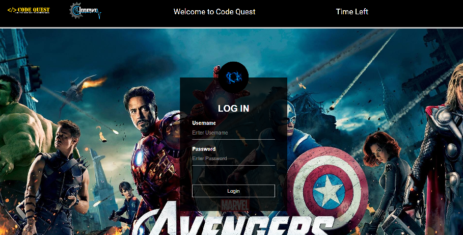
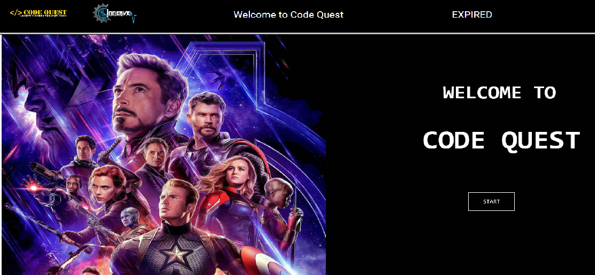

# CODE QUEST!
CodeQuest is a web based treasure hunt with HTML, CSS and Javascript. The game has five levels. Each levels has two parts- an algorithm based question and a riddle. The team which solves maximum number of questions in minimum time is the winner. This game was successfully hosted for about 150 participants.
 
 # In Action:

These are the main webpages

# Authors:
Amandeep Kaur, Drishti Gupta and Srinidhi Ayyagari

# Acknowledgement:
Would like to thank Innerve'19 for providing us the platform to host the same.

